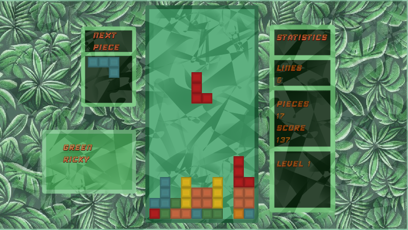

see live here : 

[GreenRicky on Youtube](https://www.youtube.com/watch?v=LbVMudgEQzY)

# Green Ricky pre-alpha version 0.8.0
## currently only tested with :

      ** Linux Debian 12 "Bookworm" + SDL 3.2.0 **
      
      ** SDL3 version 3.2.x    (dynamicly linked) **
      
      ** SDL3_image version 3.2.x (dynamicly linked) **
      
      ** gcc 12.2.0 **

## 1. "Generate" data-file for hall of fame :

### goto hall of fame directory
   cd "ProjectDir"/data/hof/
### copy hof.reset.txt to hof.txt, its a comma seperated file
   cp hof.reset.txt hof.txt  

## 2. Build the executable
### goto make directory
   cd "ProjectDir"/make/
### build the project
   make

## 3. start the executable in "ProjectDir"/make :
   ./greenr.x
   
   
